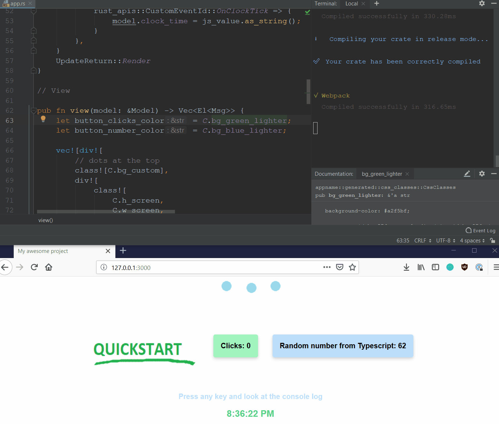

# Seed Quickstart with Webpack

<!-- prettier-ignore -->
> I want to write fast, reliable and efficient web apps. Quickly.  \
And I like documentation and WebAssembly.

Main parts:

- **[Seed](https://seed-rs.org)** - [Rust](https://www.rust-lang.org/) framework, inspired by [Elm](https://elm-lang.org/).
- **[Tailwind CSS](https://tailwindcss.com/)** - CSS framework. All CSS classes (not only Tailwind's(!)) are typed for safe use in Rust code. Unused classes are automatically deleted for much smaller bundle size.
- **[Typescript](https://www.typescriptlang.org/)** - When I need to go to the dark world of Javascript. I can generate Typescript types from Rust code for safer communication.
- **[Webpack](https://webpack.js.org/)** - It needs a little bit of magic to setup, but it's flexible and fast enough. Also it has many useful loaders and plugins and dev-server that is accessible from mobile devices.

[**LIVE DEMO**: seed-quickstart-webpack.netlify.com](https://seed-quickstart-webpack.netlify.com)

- Automatically deployed to [Netlify](https://www.netlify.com/) from `master` branch by [Travis CI](https://travis-ci.org/).
- Compressed app size is about 90 KB (look at _Developer Tools_ on demo page).

# Basic workflow

_(Recorded in [ScreenToGif](https://github.com/NickeManarin/ScreenToGif/))_

1. Start dev-server with `yarn start`.
1. Open `127.0.0.1:3000` in my browser. Or something like `192.168.0.5:3000` on my phone.
1. Change code & save it.
1. Check changes in browsers.
1. Run tests on NodeJS with `yarn test`. Or for specific browser e.g. `yarn test:firefox`.
1. If I haven't configured `.travis.yml`, I have to run `yarn build:release` and upload `/dist` folder into my server.

# I need to install

1. [Rust](https://rust-lang.org/tools/install)
1. [NodeJs](https://nodejs.org/en/download/)
1. [Yarn](https://yarnpkg.com/lang/en/docs/install)

# How to create my new app

1. Clone or download this repo.
1. Choose name for my app. E.g. "iamgroot".
1. `/package.json` - Change `author` and `name` set to "iamgroot".
1. `/crate/Cargo.toml` - Change `authors` and `description`, `name` set to "iamgroot".
1. _[Optional]_ `/crate/Cargo.toml` - Comment out last two lines (see comments in the file for more info)
1. `/entries/index.ts` - Change word "appname" to "iamgroot" everywhere.
1. `/entries/index.html` - Change `title`.
1. Modify `/README.md` and `/LICENCE`.
1. Run command `yarn` in the project root.
1. _[Optional]_ Push new app into my repository. (GitHub [guide](https://help.github.com/en/articles/adding-an-existing-project-to-github-using-the-command-line))
1. _[Optional]_ Setup auto-deploy into [Netlify](https://www.netlify.com) through [Travis CI](https://travis-ci.org). (See chapter [Continous integration](#continous-integration))

# Commands

- **`yarn build`** and **`yarn build:release`**

  - Bundle app and save it into `/dist`.
  - _Note:_ Make sure that last two lines in `/crate/Cargo.toml` are uncommented when I want to run `yarn build:release` (more info in that file)

  Build pipeline:

  - Remove previous build from `/dist/`
  - Generate styles from `/css/tailwind.js` and `/css/styles.css` (see `/configs/postcss.config.js`)
  - Generate `/crate/src/generated/css_classes.rs` from styles
  - _[only release]_ Filter out unused CSS classes from styles
  - Process styles with [autoprefixer](https://github.com/postcss/autoprefixer)
  - Compile Rust:
    - `/crate/` will be built into `/create/pkg/`
    - Typescript files included in Rust code (see `/crate/src/ts_apis.rs`) will be copied to `/crate/pkg/snippets/[id]/src/ts/`
    - _Note_: Release mode is forced now, because of bug in debug mode - app will crash after start.
  - Bundle assets (css, images, ts, js...) and uglify/minify them in the release mode. (See `/configs/webpack.config.js` and `/configs/tsconfig.json`)
  - Compile template `/entries/index.html` (i.e. Add bundle link into template and save result into `/dist/`)
  - Copy files from `/static/` into `/dist/static/`
  - _[only release]_ Optimize `/dist/[name].wasm` for size (see `/scripts/optimize_wasm.js`)

* **`yarn start`**

  - Build project and start developer server on `127.0.0.1:3000`.
  - _Note:_ Make sure that last two lines in `/crate/Cargo.toml` are commented out (more info in that file)
  - Server auto-reloads browser tabs on changes.
  - It doesn't destroy state if I change only styles (hot reload).
  - I can connect mobile devices to dev server:
    1. _Note:_ Devices and server have to be connected to the same network.
    1. [Find out](https://www.whatismybrowser.com/detect/what-is-my-local-ip-address) local IP of the device where the dev server is running.
    1. Connect mobile device with that IP and server port. E.g.: `192.168.1.5:3000`

* **`yarn test`**

  - Run tests in NodeJs.

* **`yarn test:{browser}`**

  - Run tests in headless browser.
  - `{browser}` should be `firefox`, `chrome` or `safari`.

# Project file structure

- **`.gitignore`** - Don't commit temporary files and folders. Keep `.keep` files.
- **`.travis.yml`** - Build, test and deploy master branch into Netlify.
- **`configs/`** - Build and compile settings.
  - **`postcss.config.js`** - Generate, filter and modify styles.
  - **`tsconfig.base.json`** - Strict Typescript compiler settings.
  - **`tsconfig.css_classes.json`** - Used when command `yarn generate:css_classes` is executed.
  - **`tsconfig.json`** - Main Typescript config.
  - **`webpack.config.js`** - Main Webpack config.
  - **`webpack.css_classes.config.js`** - Used when command `yarn generate:css_classes` is executed.
- **`crate/`** - Rust crate.
  - **`Cargo.lock`** - Dependency locks.
  - **`Cargo.toml`** - I can optimize build speed / size here.
  - **`pkg/`** - Folder is created after crate compilation by [wasm-pack](https://rustwasm.github.io/wasm-pack/).
    - **`.gitignore`** - Ignore all.
    - **`[app_name].d.ts`** - Generated Typescript types from Rust code for `[app_name].js`.
    - **`[app_name].js`** - Provides exported functions from Rust and loads WASM. Have to be imported only once and in async mode because of side-effects.
    - **`[app_name]_bg.d.ts`** - Types for `[app_name]_bg.wasm`.
    - **`[app_name]_bg.wasm`** - Compiled Rust code.
    - **`package.json`** - Settings generated from `Cargo.tom`.
    - **`snippets/`** - Typescript files included in Rust code.
      - **`[app_name]-[id]/`** - Directory tree is mirrored from `/crate/`.
        - **`src/`**
          - **`ts/`**
            - **`helpers.ts`**
            - **`seed_helpers.ts`**
  - **`src/`** - Contains the most important Rust and Typescript souce code.
    - **`app.rs`** - Main app parts - `Model`, `Msg`, `update`, `view`, `window_events`
    - **`generated/`** - Contains generated Rust files (except `mod.rs`)
      - **`mod.rs`** - Just exports generated modules.
      - **`css_classes.rs`** - Rust struct that contains all CSS classes with comments.
    - **`lib.rs`** - Main crate file.
    - **`rust_apis.rs`** - Rust interfaces exported to the Typescript world. See `/crate/pkg/[app_name].d.ts`.
    - **`seed_helpers.rs`** - Custom _Seed_ features - Handler for [CustomEvents](https://developer.mozilla.org/en-US/docs/Web/API/CustomEvent) and injected synchronization with browser's [animation frames](https://developer.mozilla.org/en-US/docs/Web/API/window/requestAnimationFrame) in the render loop.
    - **`ts/`** - Typescript files.
      - **`clock.ts`** - Generates `CustomEvents` with time for demo app. I can **delete** it.
      - **`helpers.ts`** - Generates random numbers for demo app. I can **delete** it.
      - **`seed_helpers.ts`** - Same as `/crate/src/seed_helpers.ts`.
    - **`ts_apis.rs`** - Typescript interfaces imported into the Rust world. Remeber that imported TS files are copied into `crate/pkg/snippets/...` so there can be problems with dependencies. See that file for more information.
  - **`target/`** - Compiled Rust and metadata.
    - \*\*`...`
  - **`tests/`** - Rust tests. Executed with `yarn test` or `yarn test:[browser]`.
    - **`test.rs`** - Super simple example test.
- **`css/`** - Foundations for styles. See [Tailwind's docs](https://tailwindcss.com/docs/configuration).
  - **`styles.css`**
  - **`tailwind.js`**
- **`dist/`** - Contains bundled app waiting for deploy after `yarn build:release`.
  - **`...`**
- **`entries`** - Webpack's entries.
  - **`index.css_classes.ts`** - Used when command `yarn generate:css_classes` is executed.
  - **`index.html`** - Template used by `HtmlWebpackPlugin`.
  - **`index.ts`** - Main entry.
- **`LICENSE`** - MIT license.
- **`node_modules/`** - NodeJS dependencies.
  - **`...`**
- **`package.json`** - Quickstart settings.
- **`README.md`** - Quickstart docs.
- **`readme_video.gif`** - Video in `/README.md`. I can **delete** it.
- **`scripts/`** - Quickstart helpers.
  - **`optimize_wasm.js`** - Optimize `*.wasm` files in `/dist/` with `wasm-opt` from library [Binaryen](https://github.com/WebAssembly/binaryen)
  - **`postcss_rust_helpers.js`** - Helps with filtering used CSS classes.
- **`static/`** - This folder will be copied into `/dist/`
  - **`images/`** - Images for demo app. I can **delete** it.
    - **`decoration.png`**
    - **`quickstart.png`**
  - **`text-polyfill.min.js`** - Polyfill for `TextDecoder` and `TextEncoder`. (See [caniuse.com](https://caniuse.com/#feat=textencoder))
- **`yarn.lock`** - Dependency locks.

# Continous integration

> How to setup Travis CI pipeline with deploy into Netlify for free

1. I've done all steps from chapter [How to create my new app](#how-to-create-my-new-app).
1. My app is in a _public_ GitHub repository.
1. Create a new [Netlify](https://www.netlify.com/) site.
1. _[Optional]_ Change site name or forward it to your domain.
1. _[Optional]_ Turn on HTTPS.
1. _[Optional]_ Turn on prerendering for better SEO. (Site detail > `Settings` > `Build & deploy` > `Prerendering`)
1. _[Optional]_ Add badge _[netlify | Success]_ to project README (Site detail > `Settings` > `General` > `Status badges`).
1. Note somewhere **Site id** (Site detail > `Settings` > `General` > _API ID_)
1. Create and note somewhere **Access token** (Click on my avatar > `User settings` > `Applications` > `New access token` > Name it for instance `TravisCI`)
1. Sync my [TravisCI](https://travis-ci.org/) account with my GitHub one.
1. Find repository with app in [my list](https://travis-ci.org/account/repositories) and click on `Settings`.
1. Add _Environment Variable_ `NETLIFY_SITE_ID` and set it's value to **Site id**.
1. Add _Environment Variable_ `NETLIFY_ACCESS_TOKEN` and set it's value to **Access token**.
1. Switch to tab `Current` and click `Activate repository`.
1. _[Optional]_ Add badge [build | passing] to project README (Repository detail > Click on badge next to the rep. name > `IMAGE URL` change to `MARKDOWN`)
1. _[Optional]_ Modify `/.travis.yml`. (If it isn't working, check Repository detail > `More options` > `Requests`)

# Browser and platform support

Quickstart has been tested in:

- `Firefox`, `Chrome` and `Edge` on Windows 10 (desktop PC)
- `Firefox`, `Chrome` and `Safari` on iOS (iPhone SE)
- _[I can create PR or Issue]_

There isn't integrated compilation from Wasm to Js, so IE is not supported. (However It should be possible with [wasm2js](https://github.com/WebAssembly/binaryen).)

# Used in projects

- One in development in private repository for now
- _[I can create PR or Issue]_

# Contributing

- Better documentation, fixed typos, updated dependencies, ... - create Issue or PR
- Ideas, bugs, questions, ... - create Issue

_Note_: Please squash commits and rebase before creating PR. Thanks!
